# 미리수(水)

## Abstract

&nbsp;Recently, due to abnormal climate conditions, South Korea has experienced an increase in the frequency of heavy rainfall, leading to an increase in instances of river overflow and low-lying area inundation. However, predicting the locations and timing of floods due to the variability of climate conditions is a challenging task that requires a substantial amount of data and complex calculations. Thus, in this study, we utilized data from the Geumgang Flood Control Office spanning from 2017 to 2021 to predict the water levels at the Gapcheon Mannyeon Bridge in 2022. Furthermore, in this study, we investigated the interrelationship among precipitation, volume flow rate, and water levels in order to achieve low error rates with a limited amount of data. Both the Prophet and LightGBM models were employed in machine learning, and the accuracy of predicted river water levels was evaluated using metrics such as Mean Absolute Percentage Error(MAPE) and Root Mean Square Error (RMSE). The evaluation of the trained models revealed that both the Prophet and LightGBM models demonstrated a low level of error in predicting river water levels. On average, the MAPE value was 3.02%, the MSE value was 0.43%, and the RMSE value was 6.49%. These results suggest that the developed models can be effectively used to predict river water levels, and this study highlights an intuitive and simple approach to predicting water levels in the Gapcheon area.Also, it provides guidelines for creating a water level prediction model with a low error rate, including when the amount of data to be learned is small.

> Key Words: Machine Learning, Water Level, Precipitation, Volume Flow Rate, Correlation

## Introduction

&nbsp;최근 이상기후로 인해 전 세계에서 다양한 형태의 자연재해로 인한 심각한 피해가 보고되고 있다. 특히, 이러한 자연재해 중 호우로 인한 저지대 침수 현상은 인명, 재산 및 사회 경제 시스템에 대규모로 피해를 야기하며 가장 파괴적인 영향을 미친다. 또한, 그 영향은 더 이상 지역적이거나 시간적으로 제한되지 않고 전 세계적인 문제로 진화하고 있다.

&nbsp;특히, 한국처럼 인구 밀도가 높은 지역에서는 호우로 인한 침수가 더욱 심각한 문제로 부상하고 있다. 국가적 차원에서도 이러한 문제에 직면하고 있음에도 불구하고 도시 하천과 같은 인구 밀집지역에서의 범람은 대규모 홍수 피해로 이어지고 있다. 최근의 사례로는 2020년 한반도 폭우 사태와 2022년 중부권 폭우 사태가 있다. 이러한 사례들은 홍수로 인한 하천의 범람을 시작으로 산사태, 저지대 침수 등 다양한 형태의 피해가 연쇄적으로 발생했다.

&nbsp;기후 변화(Climate Change)로 인한 홍수의 피해를 예방하고 최소화하기 위해서는 수문학적 관점(Hydrological Perspective)에서의 단기 및 장기적인 예측이 매우 중요하기 때문에 다양한 예측 모델에 대한 연구가 활발히 진행되고 있다(Kim et al., 2022; Kim et al., 2022; Jung et al., 2017; Osman et al., 2018; Taylor and Letham., 2017). 그러나 홍수 발생 위치와 시기에 대한 예측은 기후 조건의 동 적 성질 때문에 근본적으로 복잡하다. 따라서 오늘 날 주요한 홍수 예측 모델은 데이터에 특화되어 단순화된 가정들이 포함되며, 물리적 과정과 복잡 한 수학적 식을 모방하기 위해 결정론적, 경험적, 확률적 기법들을 활용하여 이루어진다. 물리 기반 모델은 폭풍(Costabile and Macchione., 2012; Costabile and Macchione., 2013), 하천 및 해양(Le et al., 2019; Borah., 2011)과 같은 수문학적 관점에 서 예측하는데 사용되었다. 그러나 물리 모델은 다 양한 수문 시스템을 예측하기 위해서 많은 데이터 를 확보하는데 한계가 있으며, 계산의 복잡성 때문 에 예측에 필요한 수문학적 매개 변수들을 고려하 기에 어려웠다.

&nbsp;홍수 예측 모델 개발을 위한 데이터 확보와 계 산의 복잡성과 같은 한계를 극복하기 위해, 우리는 제한된 시계열 데이터를 활용하여 Prophet 모델과 LightGBM과 같은 기계학습(Machine Learning) 알고 리즘을 구축했다. 우리가 직면한 주요 과제는 제한 된 시계열 데이터를 활용해 기계학습(Machine Learning)모델을 학습시키고 갑천의 수위를 예측하 기 위한 단순법(Simple Method)을 찾는 것이다. 특 히 우리는 데이터의 부족함을 극복하고 모델의 정 확도를 향상시키는데 초점을 맞추고 있다. 이를 위 해 2017년부터 2021년까지의 강수량(Precipitation), 수위(Water Level), 체적유량(Volume Flow Rate)의 상호 연관성을 파악하여 최종적으로 미래의 특정 시점의 수위를 예측했다. 예측한 수위의 성능 평가 를 위해서 우리는 평균 절대 백분율 오차(Mean Absolute Percentage Error, MAPE), 평균 제곱 오차 (Mean Sqaure Error, MSE), 평균 제곱근 오차(Root Mean Square Error, RMSE) 세 가지를 평가 지표로 선정하였다. 이 지표들을 통해 실제 수위와 예측된 수위 간의 오차를 정량화하고, 모델의 예측 성능을 평가했다.

## Overview

&nbsp;본 연구의 구성요소 및 그 순서도(Flow Chart)는 다음 Fig. 1과 같다.

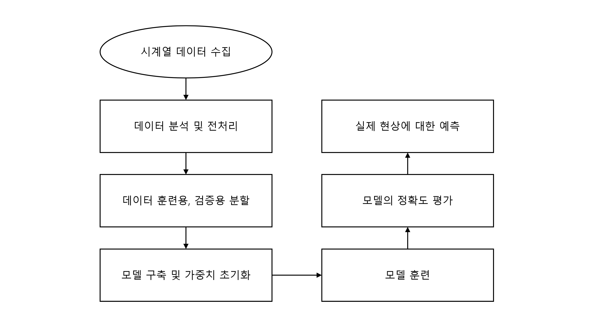

Fig. 1. Flow Chart for Building Flood Prediction Method

&nbsp;본 연구에서는 유량 및 강수량 자료를 통해서 침수 예방을 위하여 수위 예측 시스템을 개발하였다. 이를 위하여 유량과 강수량에 대한 시계열 자료를 수집하였으며, 결측치 제거 등의 전처리를 진행했다. 다음으로, 인공지능 학습 과정에서 과적합을 막기 위하여 2017년부터 2022년의 전체 시계열 데이터들을 훈련용(2017년 ~ 2021년 12월)과 검증용(2022년 01월 ~ 2022년 12월)으로 분할하여 학습 시 과적합 여부를 확인하였다. 그다음, Prophet과 LightGBM 모델을 구축하고, 가중치를 임의로 초기화하여 모델을 훈련시켰으며, 모델의 성능을 확인하기 위하여 평균 절대 백분율 오차(Mean Absolute Percentage Error, MAPE)와 평균 제곱 오차(Mean Square Error, MSE) 평균 제곱근 오차(Root Mean Square Error, RMSE)의 세 개의 성능지표를 이용하였다. 이러한 성능지표를 통해 모델의 정확도를 평가한 다음, 두 모델 중 정확도가 더 높게 산출되는 모델을 통해 실제 현상인 갑천의 만년교 수위에 대한 예측을 진행하도록 본 연구를 구성하였다.

## Data Collection, Analysis, and Preprocessing

### Data Collection

&nbsp;본 연구에서는 대전광역시 갑천의 홍수예방 및 재발방지를 위하여 만년교를 주 연구대상으로 선정하였다. 기계학습(Machine Learning) 모델 구축에 앞서, 수위를 예측할 수 있는 특징(Feature)에 해당하는 자료와 정답(Labels)인 수위자료의 수집을 위하여 금강 홍수통제소에서 제공하는 2017년 1월부터 2022년 12월까지 총 6년의 유량 및 강수량, 수위 데이터를 활용하였다.

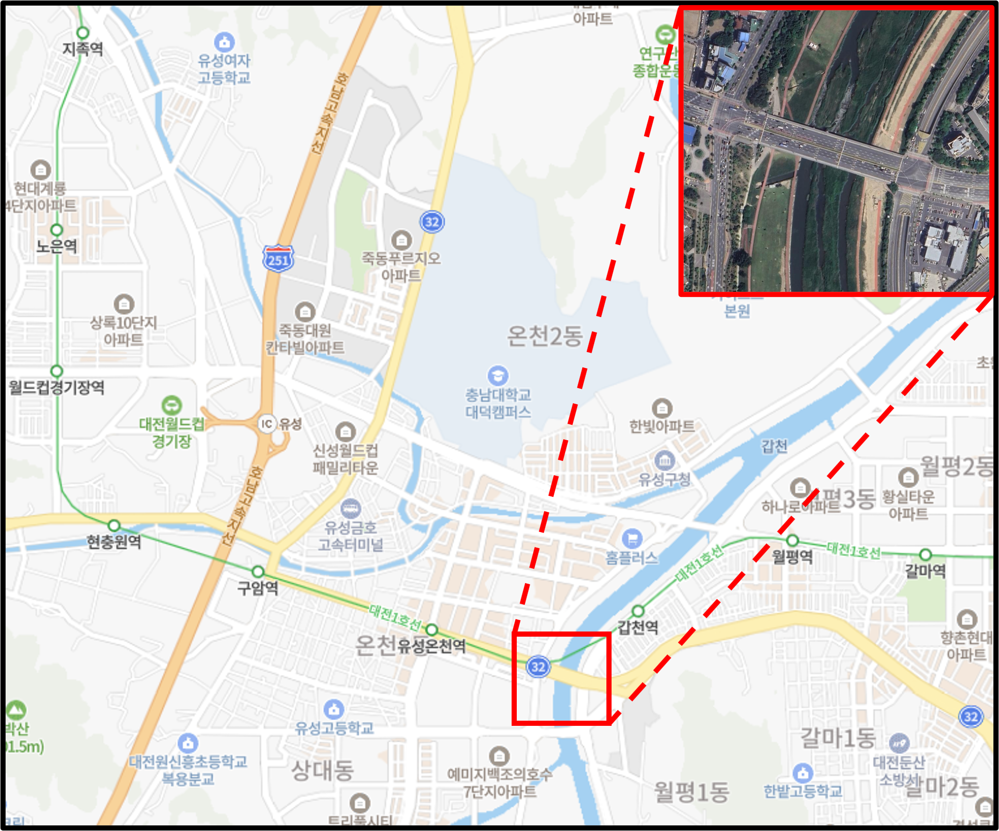

Fig. 2. Geographical Location of Gabcheon and Enlarged Photograph of the Mannyeon Bridge

&nbsp;Fig. 2는 침수 예측 모델의 구축을 위해 수집한 시계열 데이터를 사용한 대상 지역인 갑천의 지리적 특징과 확대된 만년교의 사진을 보여준다. 갑천은 대둔산에서 시작하여 대전 지역을 통과하며 길이가 73.7km인 금강 지류의 한 부분이다. 이 갑천은 금강과 합류하기 전에 대전 지역을 가로지르며 유역 내 지역의 수질 및 수량 변화에 중요한 영향을 미친다. 갑천의 수위는 계절에 따라 변동하는데, 봄에는 Melting Snow와 빗물로 인해 수위가 상승할 수 있고, 여름에는 장마와 강우로 인해 수위가 더욱 높아진다.

&nbsp;특히, 만년교는 갑천 주변에서 발생하는 강수량 증가로 인해 장마 기간 동안 반복적으로 침수되는 주요 지점 중 하나이다. 연례적으로 홍수로부터 영향을 받아 지역 사회와 교통에 불편을 초래하는 사례가 발생하고 있다. 따라서 우리 연구는 갑천에서 수집한 다양한 요소의 시계열 데이터를 활용한 예측 모델을 개발하여 홍수 발생 가능성을 사전에 예측하고자 한다.

### Data Analysis

#### 강수량(Precipitation)

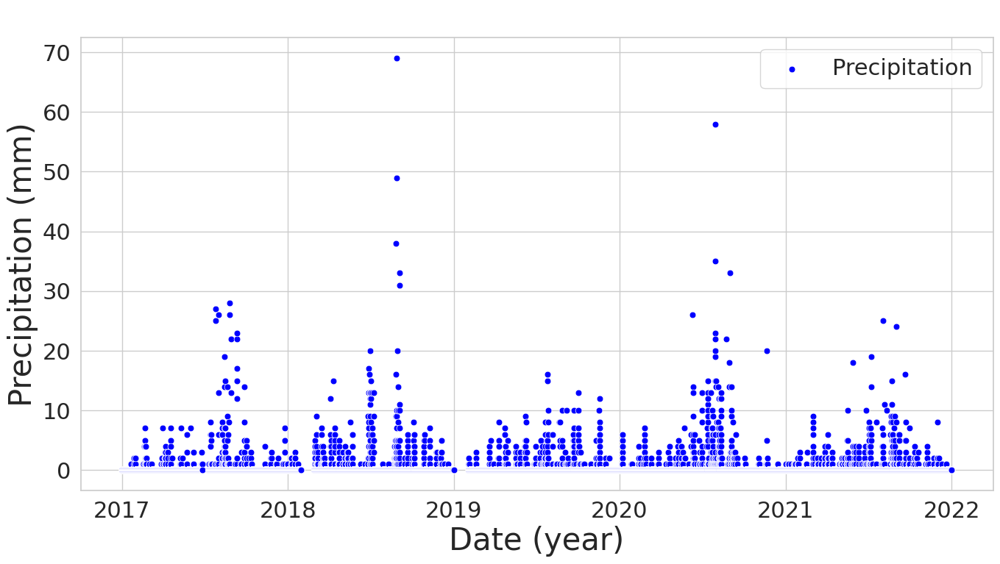

Fig. 3. Visualization of the Distribution of Precipitation in Gapcheon from 2017 to 2021

&nbsp;Fig. 3은 2017년부터 2021년까지의 갑천의 강수량의 분포를 시각화한 그래프이다. 이 그래프에서 파란점들은 각 시간당 강수량을 나타내며, 이를 통해 연도별 기후 변화와 강수량 분포를 파악할 수 있다.

&nbsp;Fig. 3에서 볼 수 있듯이, 모든 년도에서 3분기(여름~가을)에 시간당 강수량이 높은 경향을 보이며, 이는 갑천 지역의 기후 특성을 확인할 수 있다. 특히, 2018년과 2020년에는 각각 70mm/hour와 58mm/hour로 3분기에 높은 시간당 강수량을 기록했다. 이러한 값들은 다른 년도와 비교해도 상당히 높은 수준에 해당하며, 두 해의 3분기는 기후적으로 비교적 습한 조건을 가지던 시기로 해석된다.

#### 수위(Water Stage)

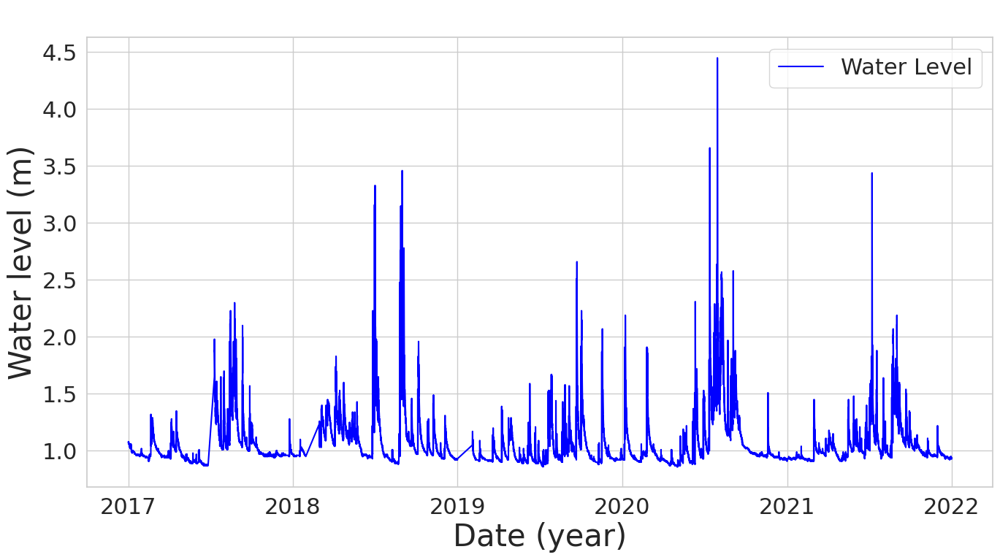

Fig. 4. Visualization of the Distribution of Water Stage in Gapcheon from 2017.01 to 2021.12

&nbsp;Fig. 4는 2017년부터 2021년까지의 갑천의 수위 분포를 시각화한 그래프이다. 이 그래프에서 파란선들은 시간에 따른 갑천의 수위 변화를 나타내며, 연도별로 수위의 변동을 파악할 수 있다. 특히, Fig. 3에서 볼 수 있듯이, 2018년과 2020년의 3분기에는 높은 강수량이 관찰되었다. 이로인해 갑천의 수위가 급격하게 상승하는 경향을 보였으며, 이는 강수량과 수위 사이에 상호 연관성이 있음을 유추해볼 수 있다.

&nbsp;결과적으로, 2018년과 2020년에 관찰된 높은 강수량과 수위의 상승은 서로 강한 연관성을 나타내며, 특히 3분기에 이러한 경향성이 두드러져 보인다. 이러한 관계성은 갑천에서의 강우와 수위 상승간의 관계를 명확하게 보여주며, 수위 변화가 강우의 영향을 크게 받는다는 것을 말한다.

#### 체적유량(Volume Flow Rate)

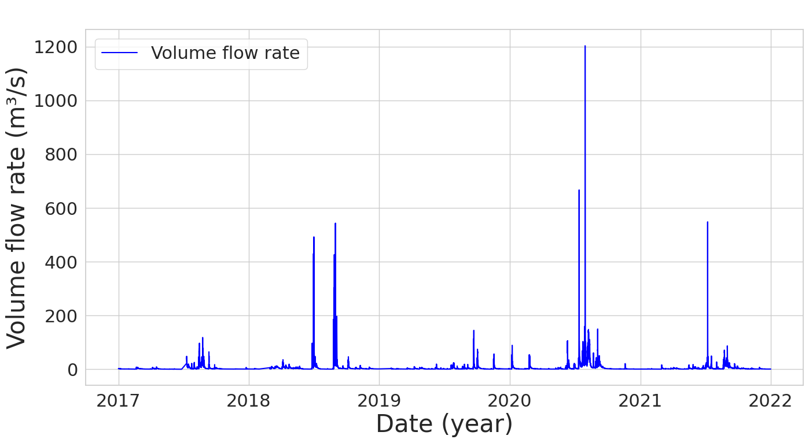

Fig. 5. Visualization of the Distribution of Volume Flow Rate in Gapcheon from 2017.01 to 2021.12

&nbsp;Fig. 5는 2017년부터 2021년까지의 갑천의 체적유량의 분포를 시각화한 그래프이다. 이 그래프에서 파란선들은 시간에 따른 체적유량을 의미하며, 이를 통해 연도별 갑천지역의 체적유량을 파아할 수 있었다. 특히, 2018년과 2020년에는 체적유량이 각각 약 570 m3/s와 1200m3/s로, 다른 연도와 비교하여 높은 수준의 체적유량을 보였다.

&nbsp;이에 따라 강수량 증가(Fig. 3 참조)가 수위의 증가(Fig. 4 참조)로 이어지며, 증가한 갑천의 체적으로 인해 체적유량 또한 증가(Fig. 5 참조)하는 양상으로 이어진 것을 확인할 수 있다. 또한, 강수량, 수위 그리고 체적유량의 접점(Peak Point)의 지점들이 동일한 경향을 보인다는 사실도 관찰된다. 이는 높은 강수량을 기록한 시기에 갑천의 수위가 증가하여 체적유량이 증가하는 경향성을 나타내며, 이는 강수량, 수위 그리고 체적유량 사이의 연관성을 파악하는 것이 갑천의 수위 예측 모델을 개발하는 데 중요한 요소일 것이라 판단된다.

### Data Preprocessing

#### 결측치(Missing Values) 제거

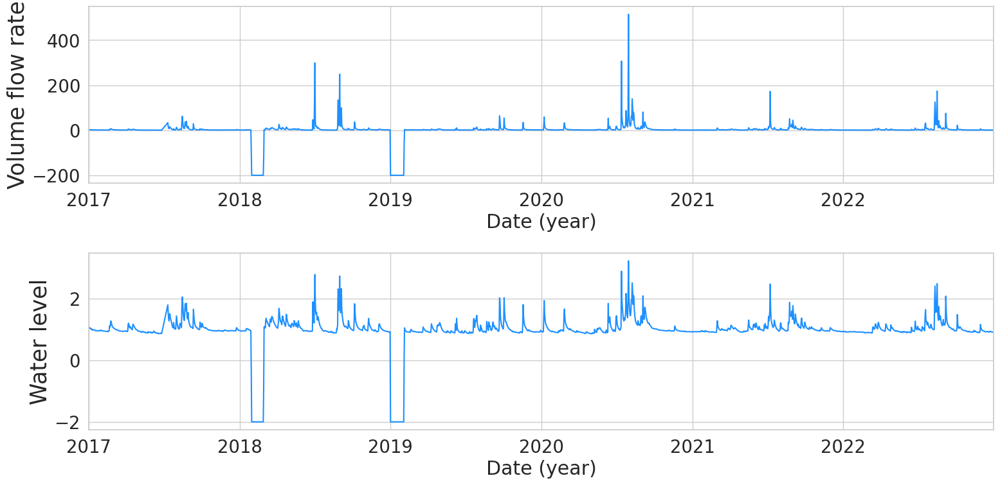

Fig. 6. Missing Values of Core Features

&nbsp;Fig. 6과 같이 2018년과 2019년에 일부 데이터가 없는 것을 확인할 수 있다. 따라서 결측치를 채우기 위해서 보간된 값으로 채워넣는 보간법을 사용하였다.

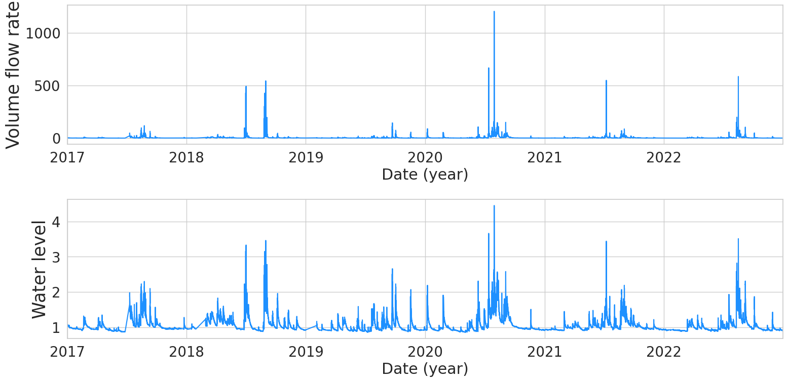

Fig. 7. Filled by Interpolated Values

&nbsp;Fig. 7은 보간법을 적용하여 결측치를 채워넣은 모습이다.

#### 리샘플링(Resampling)

&nbsp;리샘플링(Resampling)을 진행하여 데이터를 증대 또는 감소시킬 수 있다. 본 연구에서는 24시간으로 나누어진 데이터를 평균값으로 대체하여 일 단위로 끊어서 학습을 진행하였다.

#### 정상성(Stationarity)

&nbsp;정상성(Stationarity)은 데이터의 확률적인 성질들이 시간의 흐름에 따라 변화하지 않는다는 것을 의미한다. 이는 평균, 공분산, 분산 등이 시간에 의존하지 않는다는 것을 의미한다. 우리가 사용하는 데이터가 과연 비정상성을 갖고 있는지 확인해야 추세와 계절성을 가진 시계열 데이터로 분석할 의미를 갖는다. 정상성은 시각적, 기초 통계량, 통계적 검정을 통해서 확인할 수 있다. 그 중 Augmented Dickey - Fuller (ADF) 검정은 단위근 검정으로 비정상성을 확인할 수 있다.

* 귀무가설 H0: 시계열은 고정되어 있지 않다.
* 대립가설 H1: 시계열은 정지 상태이다.

&nbsp;귀무가설을 기각하는 방법은 두 가지로 P-value를 통한 방법과 ADF 통계량을 통한 방법이 있다. P-value를 통한 방법은 P-value > 유의수준(Default: 0.05)이면 귀무가설을 채택한다. P-value <= 유의수준(Default: 0.05)이면 귀무가설을 기각한다. ADF 통계량을 통한 방법은 ADF Statistics > Critical Value이면 귀무가설을 채택한다. ADF Statistics < Critical Value이면 귀무가설을 기각한다.

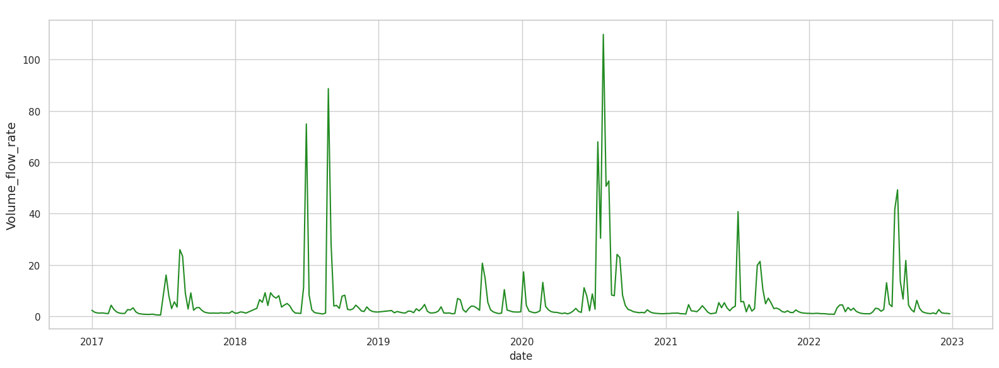

Fig. 8. P-values & ADF Statistics of Volume Flow Rate

&nbsp;Fig. 8에서 체적유량의 ADF Statistics의 값은 -5.088으로 Critical Values 5%에 해당하는 -2.871보다 큰 값이 도출되었다. 따라서 체적유량의 시계열 자료는 고정되어 있지 않다.

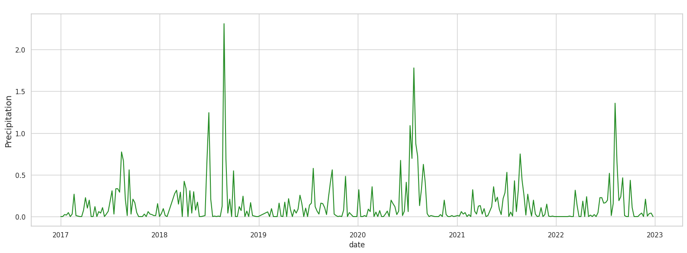

Fig. 9. P-values & ADF Statistics of Precipitation

&nbsp;Fig. 9에서 강수량의 ADF Statistics의 값은 -11.797으로 Critical Values 5%에 해당하는 -2.871보다 큰 값이 도출되었다. 따라서 강수량 시계열 자료는 고정되어 있지 않다.

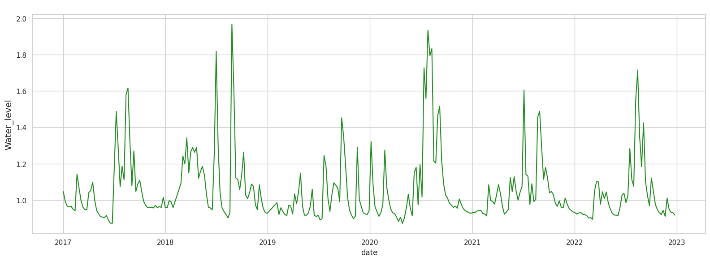

Fig. 10. P-values & ADF Statistics of Water Stage

&nbsp;Fig. 10에서 수위의 ADF Statistics의 값은 -8.188으로 Critical Values 5%에 해당하는 -2.871보다 큰 값이 도출되었다. 따라서 수위 시계열 자료는 고정되어 있지 않다.

&nbsp;다음과 같이 값이 특정 변수들의 시계열이 고정되어 있지 않음을 보여준다. 이를 해결하는 방법으로 데이터를 변환하여 적용을 해야하는데, 일반적인 두 가지 방법은 로그 또는 제곱근을 적용하거나 차분하여 시계열을 고정할 수 있다. 본 연구에서는 차분하여 시계열을 고정하는 방법을 사용하였다. 이러한 차분은 Eq. 1의 1차 차분과 Eq. 2의 2차 차분으로 나뉜다.

&nbsp; 1차 차분은 다음 식을 적용한다.

$$z_{i} = y_{i} - y_{i-1}$$

Eq. 1. 1st Difference Equation

Eq. 1의 1차 차분을 각 자료에 적용한 결과 그래프는 Fig. 11 ~ 13과 같다.

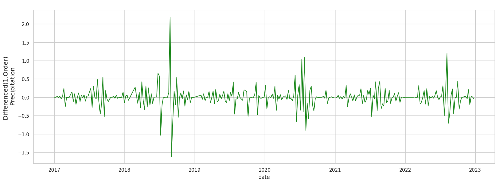

Fig. 11. First-order Differentiated Volume Flow Rate

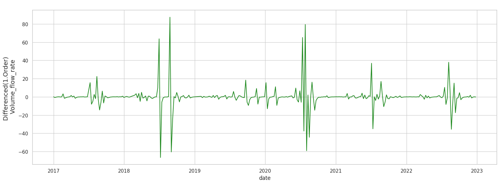

Fig. 12. First-order Differentiated Precipitation

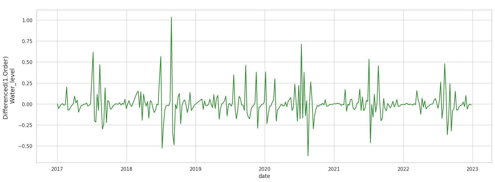

Fig. 13. First-order Differentiated Water Stage

&nbsp; 2차 차분은 다음 식을 적용한다.

$$z_{i} = (y_{i} - y_{i-1}) - (y_{i-1} - y_{i-2})$$

Eq. 2. 2nd Difference Equation

Eq. 2의 2차 차분을 각 자료에 적용한 결과 그래프는 Fig. 14 ~ 16과 같다.

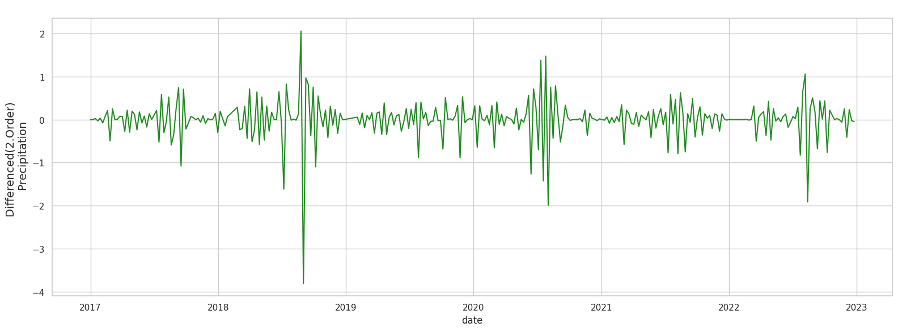

Fig. 14. Second-order Differentiated Volume Flow Rate

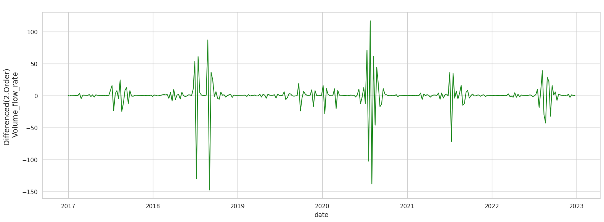

Fig. 15. Second-order Differentiated Precipitation

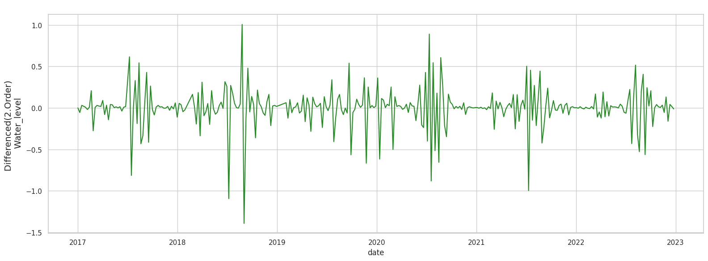

Fig. 16. Second-order Differentiated Water Stage

그 결과, 1차 차분을 적용한 결과 그래프에서 더 적은 정상성을 가짐을 확인하였고, 이에 2차 차분이 아닌, 1차 차분으로 전처리를 진행하였다.

#### 히트맵(Heat Map)

&nbsp;수집한 유량 및 강수량 데이터와 수위 간의 상관관계를 확인하기 위하여 상관관계(Correlations)에 대한 행렬(Matrix)을 생성한 다음, 이를 히트 맵(Heat Map) 형태로 그 관계를 도식화하였으며, 그 결과는 다음 Fig. 17과 같았다.

Fig. 17. Visualization of Heat Maps for Correlations between Features and Labels

&nbsp; Fig. 17로부터 히트 맵의 대각성분들은 모두 동일한 특징들에 대한 상관관계이므로 1이 도출되었으며, 체적유량(Volume Flow Rate)과 수위(Water Stage), 강수량(Precipitation)과 수위(Water Stage)간에 각각 0.84, 0.87로 특징(Features)과 정답(Labels)들 간에 비교적 선형의 상관관계를 보임을 확인하였다.

#### 훈련(Train) 및 테스트(Test) 데이터셋(Datasets)

Table. 1. Train and Test Datasets

| Date  (2017.01.01) | Volume Flow Rate   (m3/s) | Precipitation   (mm/hr) | Water Stage   (m)   (=y) |
|:-----------------:|:-----------------------:|:---------------------:|:--------------------:|
|      00:00:00     |           2.68          |          0.0          |         1.07         |
|      01:00:00     |           2.84          |          0.0          |         1.08         |
|      02:00:00     |           2.84          |          0.0          |         1.08         |
| $\cdots$ | $\cdots$ | $\cdots$ | $\cdots$ |

&nbsp; Table. 1에서 확인할 수 있듯이, 데이터셋(Datasets)은 기본적으로 다변량(Multivariate)의 시계열(Time Series) 데이터로, 체적유량(Volume Flow Rate)과 강수량(Precipitation)의 두 특징 데이터와 정답인 수위(Water Stage) 데이터로 구성되어 있다. 예측 모델로의 데이터 주입이 용이하도록 기존에 분리되어 있던 세 개의 개별적인 데이터들을 하나의 자료 형태로 취합하였다.

## Build and Train Models

### Prophet Model

&nbsp; 수위 예측을 위한 다변량 기계학습 모델로서 페이스북(Facebook)에서 공개한 시계열 예측 모델인 Prophet을 선정하였다. 본 모델은 일반화된 가산 모델(GAM)(Hastie & Tibshirani 1987)과 유사하며, 회귀모델임에도 불구하고 시간을 구성요소로 하는 선형과 비선형 회귀 모델 기능을 수행할 수 있다. GAM의 형태를 갖춤으로 새로운 구성요소를 추가하고, 변형하기 쉽다. ARIMA 모델과 달리 측정값에 일정한 간격을 유지할 필요가 없으며, 누락된 값을 보간할 필요가 없다. 학습의 속도도 뛰어나 더 쉽게 모델을 사용할 수 있다.

Eq. 3. Prophet Model

$$y(t) = g(t) + s(t) + h(t) + \epsilon_{t}$$

&nbsp; Prophet 모형은 Eq. 3와 같은 함수를 가지며, 추세(Trend), 계절성(Seasonality), 휴일과 이벤트(Holidays and Events)의 3가지 주요 요소로 구성된다. 

#### 추세(Trend)

&nbsp; 비주기적 변화를 모델링하는 추세 함수로 기본적으로 성장성을 반영한다.

Eq. 4. Piecewise Logistic Growth Model

$$g(t) = \frac{C}{1 + exp(-k(t-m))}$$

&nbsp; 여기서 $C$는 한계점을 나타내는 수용력, $k$는 성장률, $t$와 $m$은 각각 시간과 오프셋(Offset) 파라미터를 의미한다.

#### 계절성(Seasonality)

&nbsp; 주기적 변화를 반영하는 함수로 반복되는 패턴(Pattern)에 특징을 반영한다.

Eq. 5. Seasonality Approximation Fourier Function

$$s(t) = \sum_{i=1}^{N}(a_{n}cos(\frac{2\pi{nt}}{P}) + b_{n}sin(\frac{2\pi{nt}}{P}))$$

&nbsp; 여기서 $P$는 시계열 모델에서 기대하는 정규주기로 기간(Periods)을 의미한다.

## Applications

### :construction: Architectures

### User Interface (UI)

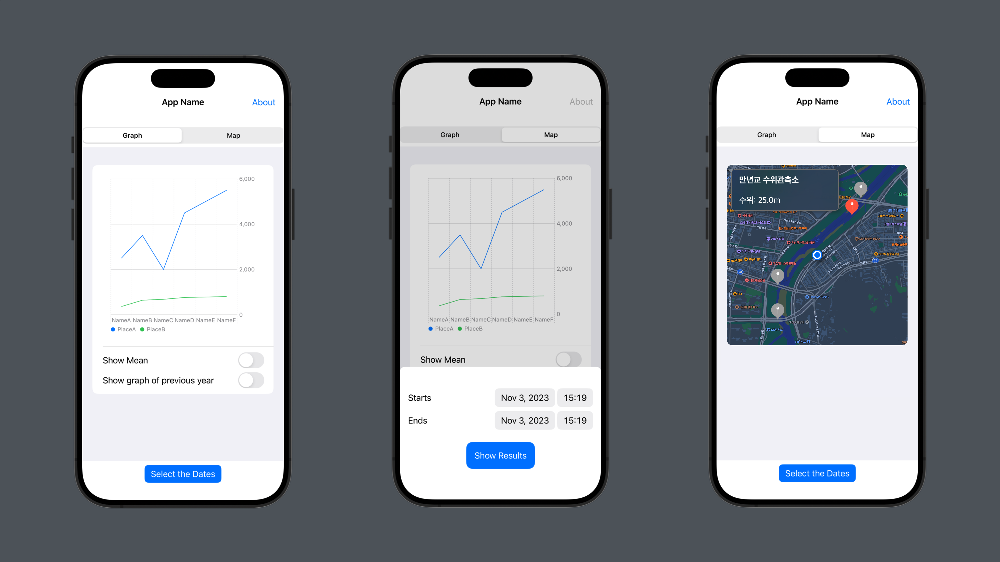

Fig. x. User Interface

### Demo

Fig. x. Demo Alerts

## References

Kim, D., Han, H., Wang, W., & Kim, H. S. (2022). Improvement of Deep Learning Models for River Water Level Prediction Using Complex Network Method. Water, 14(3), 466.

Kim, D., Lee, K., Hwang-Bo, J. G., Kim, H. S., & Kim, S. (2022). Development of the Method for Flood Water Level Forecasting and Flood Damage Warning Using an AI-based Model. Journal of the Korean Society of Hazard Mitigation, 22(4), 145–156.

Kyungpook National University, Jung, S., Lee, D., Kyungpook National University, Lee, K., & Kyungpook National University. (2017). Prediction of River Water Level Using Deep-Learning Open Library. Korean Society of Hazard Mitigation, 18(1), 1–11.

Osman, S., Aziz, N. A., Husaif, N., Sidek, L. M., Shakirah, A., Hanum, F., & Basri, H. (2018). Application of Stochastic Flood Forecasting Model Using Regression Method for Kelantan Catchment. MATEC Web of Conferences, 203, 07001.

Taylor, S. J., & Letham, B. (2017). Forecasting at scale[Preprint]. PeerJ Preprints.

Costabile, P., Costanzo, C., & Macchione, F. (2012). Comparative analysis of overland flow models using finite volume schemes. Journal of Hydroinformatics, 14(1), 122–135.

Costabile, P., Costanzo, C., & Macchione, F. (2013). A storm event watershed model for surface runoff based on 2D fully dynamic wave equations: A WATERSHED RUNOFF MODEL BASED ON 2D FULLY DYNAMIC WAVE EQUATIONS. Hydrological Processes, 27(4), 554–569.

Le, Ho, Lee, & Jung. (2019). Application of Long Short-Term Memory (LSTM) Neural Network for Flood Forecasting. Water, 11(7), 1387.

Borah, D. K. (2011). Hydrologic procedures of storm event watershed models: A comprehensive review and comparison. Hydrological Processes, 25(22), 3472–3489.

## Comments

> 본 글과 저장소(Repository)의 저작권은 김종혁, 이성지, 김민중, 나종열에게 있습니다. 무단 도용, 배포, 복제를 금합니다.

> 또한, 앱의 디자인 및 소스코드는 박유상, 고태완에게 있습니다. 무단 도용, 배포, 복제를 금합니다.

> 필요하신 자료나 정보가 있으신 경우, 본 논문의 교신저자(Corresponding Author)인 나종열의 [이메일](najyeol99@gmail.com)로 연락주시기 바랍니다.